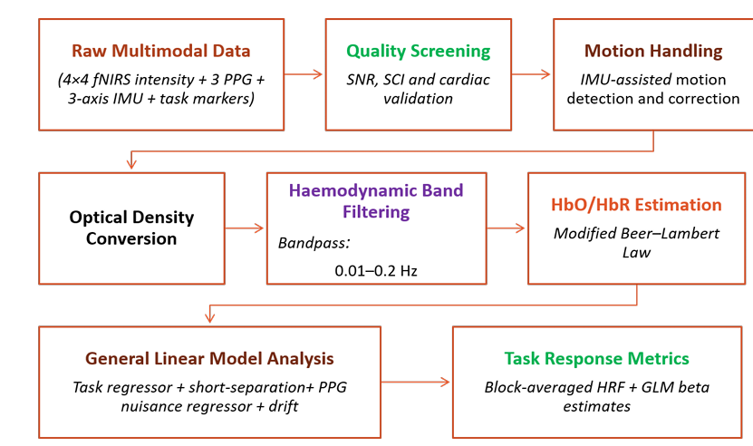
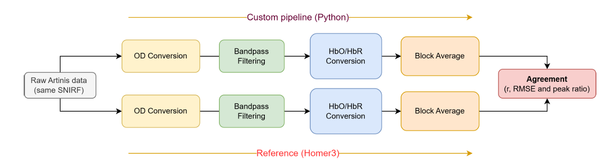
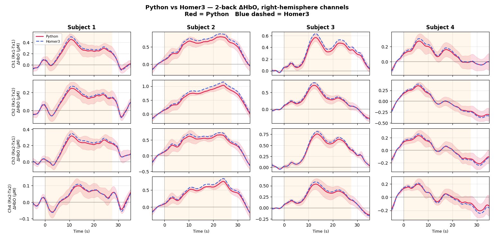

# Multimodal fNIRS Processing Pipeline

A Python framework for preprocessing and analysing wearable **multimodal functional near-infrared spectroscopy (fNIRS)** recordings.

This repository contains the processing pipeline developed during my **Erasmus Mundus Master's thesis in Biomedical Engineering (EMMBIOME)** titled:

> **Experimental Validation and Signal Processing of a Wearable Multimodal fNIRS System for Robust Haemodynamic Response Analysis**

The framework extends conventional fNIRS signal processing by integrating synchronized **photoplethysmography (PPG)**, **inertial measurement unit (IMU)**, and **task-marker** data to improve signal quality assessment, motion artifact handling, and haemodynamic response estimation.

---
# Dataset

The processing pipeline was developed and evaluated using multimodal recordings collected from **13 healthy participants** during a working memory experiment (https://github.com/Khadijakhanbme/N-back-Cognitive-Load-Task).

The acquisition protocol included:

- Wearable multimodal fNIRS recordings
- Photoplethysmography (PPG)
- Inertial Measurement Unit (IMU)
- Event markers (rest, 0 back and 2 back)

Due to ongoing research and manuscript preparation, the dataset is **not publicly available** at this time.

# Features

- Multimodal fNIRS preprocessing
- Timestamp synchronization and event alignment
- Signal quality assessment
- Automatic channel selection
- IMU-assisted motion artifact detection
- Targeted PCA motion correction
- Optical Density (OD) conversion
- Hemodynamic band-pass filtering
- Modified Beer–Lambert Law (MBLL)
- General Linear Model (GLM)
- Short-Separation Regression (SSR)
- PPG-based physiological nuisance regression
- Block-averaged haemodynamic response estimation
- Comprehensive diagnostic visualization
- Baseline validation against Homer3

---

# Processing Pipeline

The complete processing workflow implemented in Python is illustrated below.

<p align="center">
  
</p>

The pipeline integrates synchronized **fNIRS**, **PPG**, **IMU**, and **task-marker** data to perform signal quality assessment, motion handling, haemodynamic estimation, and statistical analysis of task-evoked brain responses.

---

# Implementation Validation

Before extending the framework with multimodal signal processing, the baseline Python implementation was validated against the widely used **Homer3** toolbox.

Both implementations processed identical timestamp-aligned SNIRF recordings using equivalent preprocessing steps. Agreement between the resulting haemodynamic responses confirmed the correctness of the baseline implementation and established a reliable foundation for the subsequent multimodal processing framework.

<p align="center">
  
</p>

### Baseline Validation Results

The figure below compares representative block-averaged ΔHbO responses generated by the custom Python implementation and Homer3. The close agreement demonstrates that the baseline processing chain reproduces established fNIRS analysis before incorporating the multimodal extensions developed in this work.

<p align="center">
  
</p>

---

# Example Outputs

The following figures illustrate representative outputs generated by different modules of the processing pipeline.

## IMU-assisted Motion Artifact Correction

The pipeline combines synchronized IMU measurements with targeted PCA-based correction to identify and suppress motion artifacts while preserving physiological information. Diagnostic outputs include corrected signals, removed artifact components, corrected motion windows, and post-correction cardiac visibility.

<p align="center">
  
</p>

---

## General Linear Model (GLM)

Task-evoked haemodynamic responses are estimated using the General Linear Model (GLM). The framework supports multiple nuisance-regression strategies, including Short-Separation Regression (SSR) and synchronized PPG-derived physiological regressors.

The figure below illustrates representative GLM outputs produced by different processing configurations.

<p align="center">
  
</p>

---

## Haemodynamic Response Estimation

Following preprocessing and statistical modelling, the framework computes block-averaged haemodynamic responses for HbO and HbR.

The example below illustrates representative group-level haemodynamic response visualizations generated by the pipeline.

<p align="center">
  
</p>

---

# Repository Structure

```text
.
├── scripts/
│   ├── 1.Batch_diagnosis.py
│   ├── 2.Resampling.py
│   ├── 3.Timestamp_Alignment.py
│   ├── 4.Quality+PPG.py
│   ├── 5a.Channel_Selection.py
│   ├── 5b.Motion_Correction.py
│   ├── 5c.OD_Conversion_Bandpass.py
│   ├── 6.GLM_cases_SSR.py
│   └── 7.hrf_grid_GLM.py
│
├── docs/
│   ├── processing_pipeline.png
│   ├── validation_pipeline.png
│   ├── python_vs_homer3.png
│   ├── motion_correction_example.png
│   ├── glm_analysis_example.png
│   └── hrf_example.png
│
├── README.md
├── LICENSE
├── requirements.txt
└── .gitignore
```

---

# Requirements

- Python 3.10+
- NumPy
- Pandas
- SciPy
- Matplotlib

Install dependencies using:

```bash
pip install -r requirements.txt
```

---

# Project Background

This repository contains the signal processing framework developed during my Master's thesis, focused on the evaluation of a compact multimodal fNIRS sensor developed at the **Electronics and Informatics Department (ETRO), Vrije Universiteit Brussel (VUB)**.

Documentation and additional examples will be expanded in future releases.

---

# Future Work

Planned improvements include:

- Enhanced documentation
- Configuration-based processing
- Example datasets
- Modular package structure
- Automated processing workflow
- Companion journal publication and citation

---

# Citation

If you find this repository useful in your research, please consider citing the accompanying publication (to be added upon publication).
